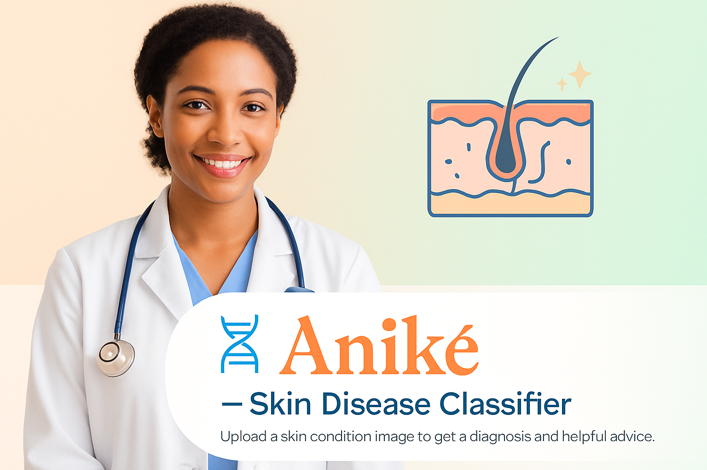

# Àníkẹ́ – Skin Disease Detector 🧬✨

## Overview

**Àníkẹ́** is a powerful AI-powered dermatological assistant built to detect and classify 22 types of skin diseases using deep learning. It provides personalized suggestions for each disease, enhancing awareness and early care.

Whether you're a health enthusiast, medical practitioner, or just curious, Àníkẹ́ brings the power of AI to your fingertips for skin health monitoring.

---

## Disease Classes and Recommendations

Below are the 22 skin diseases this model can detect, along with actionable advice for each:

- **Acne**: Maintain a consistent skincare routine, avoid heavy makeup, and consider salicylic acid or benzoyl peroxide. Consult a dermatologist for persistent acne.
- **Actinic Keratosis**: Limit sun exposure, use SPF 30+ sunscreen daily, and have regular skin checks due to cancer risk.
- **Benign Tumors**: Usually harmless. Monitor for changes and seek medical advice if they grow or change color.
- **Bullous**: Do not pop blisters. Keep them clean and consult a doctor. Autoimmune types need urgent care.
- **Candidiasis**: Keep skin dry and clean. Use antifungal creams and avoid tight clothing. Maintain good hygiene.
- **Drug Eruption**: Stop suspected medication and see a doctor immediately. Keep track of new prescriptions.
- **Eczema**: Moisturize regularly, avoid irritants like wool or scented products, and use topical steroids if prescribed.
- **Infestations/Bites**: Use insect repellents, clean bites with antiseptic, and treat infestations with medicated creams.
- **Lichen**: Manage with prescribed corticosteroids. Avoid scratching and reduce stress.
- **Lupus**: Avoid sunlight and use protective clothing. See a rheumatologist for systemic symptoms.
- **Moles**: Track any ABCDE changes (Asymmetry, Border, Color, Diameter, Evolving). Visit a dermatologist if suspicious.
- **Psoriasis**: Keep skin moist, avoid triggers like stress, and follow prescribed treatments including phototherapy.
- **Rosacea**: Identify and avoid triggers (spicy food, alcohol, sunlight). Use gentle skincare and prescribed treatments.
- **Seborrheic Keratoses**: Benign but can be removed if irritated. Monitor for changes and rule out malignancy.
- **Skin Cancer**: Early detection is key. Use sunscreen, avoid tanning, and have moles/lesions evaluated regularly.
- **Sunlight Damage**: Regularly apply broad-spectrum SPF, wear hats/sunglasses, and use antioxidants in skincare.
- **Tinea (Ringworm)**: Use antifungal creams, avoid sharing personal items, and keep skin dry.
- **Unknown/Normal**: If unsure, observe and seek professional dermatological advice for peace of mind.
- **Vascular Tumors**: Most are harmless. Monitor for changes or growth. See a dermatologist if concerned.
- **Vasculitis**: Can signal systemic illness. Seek urgent care. Avoid self-treatment.
- **Vitiligo**: Use sunscreen to protect depigmented areas. Cosmetic treatments and therapy may help.
- **Warts**: Use salicylic acid-based treatments. Avoid picking to prevent spreading.

---

## Author

Crafted with care by **Akinola Samuel Afolabi** 🧠💡  
_Àníkẹ́_ means “one who is cherished” — this app is designed to cherish and protect your skin health.  

## ⚠️ Disclaimer

The **Àníkẹ́ – Skin Disease Classifier** is an AI-powered tool designed to assist in the **identification** of various skin conditions **for educational and informational purposes only**.

> 🔍 It is **not a substitute** for professional medical advice, diagnosis, or treatment.

- Always consult a **qualified dermatologist or medical professional** for concerns regarding skin health.
- This tool may provide **probable suggestions**, but accuracy is not guaranteed.
- **Do not self-medicate or delay treatment** based on the results provided by this application.

By using this tool, you acknowledge that the developers and contributors are **not responsible for any decisions** made based on its output.
